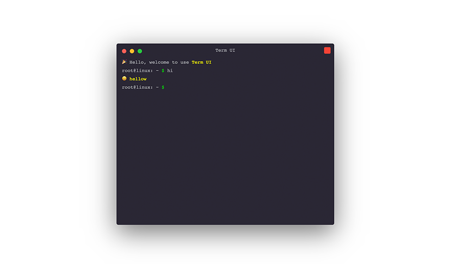

# Term-Web

> :pager: A Simple Terminal UI That Run On The Web


[](https://www.npmjs.com/package/term-web)



## Demo

[Checkout the demo](https://term-web.js.org) from Github Pages

## Install

Install with `npm`:

```bash
$ npm install term-web
```

Or install with `yarn`:

```bash
$ yarn add term-web
```

```js
import Term from 'term-web';
```

Or umd builds are also available:

```html
<script src="path/to/term-web.js"></script>
```

Or from jsDelivr CDN:

```html
<script src="https://cdn.jsdelivr.net/npm/term-web/dist/term-web.js"></script>
```

Will expose the global variable to `window.Term`.

## Usage

```html
<div id="term"></div>
```

```js
var term = new Term({
    // ... options
    container: '#term',
});
```

## Options

```js
{
    // Mounted dom element
    container: '#term',

    // Initial size
    width: 600,
    height: 500,

    // Custom actions
    actions: [],

    // Options when parsing parameters with minimist
    // https://github.com/substack/minimist
    parseOpt: {},

    // Use the display recorder button
    recorder: true,

    // Is it draggable
    draggable: true,

    // Border radius
    borderRadius: 5,

    // Font size
    fontSize: 13,

    // Font family
    fontFamily: 'Arial',

    // Font color
    fontColor: '#b0b2b6',

    // Box shadow
    boxShadow: 'rgba(0, 0, 0, 0.55) 0px 20px 68px',

    // Background color
    backgroundColor: 'rgb(42, 39, 52)',

    // Title on the topbar
    title: 'Term Web',

    // Entered prefix
    prefix: 'root@linux: ~ <d color="#00f501">$</d> ',

    // Welcome Message
    welcome: `Last login: ${new Date()}`,

    // Loading tips
    loading: (val) => '<d color="yellow">Loading...</d>',

    // Pixel ratio
    pixelRatio: window.devicePixelRatio,

    // Callback when command is not found
    notFound: (val) => `-bash: <d color='red'>${val}</d>: command not found`,
}
```

## API

#### nput and output

The main commonly used methods in the example are two `term.input` and`term.input`.

-   `text` is the string to be displayed.
-   `isReplace` indicates whether to replace the previous record, default is `false`;

```js
term.input(text, isReplace);
term.output(text, isReplace);
```

#### Clear all log

```js
term.clear();
```

#### Example

```js
term.input('foo');
// output => 'foo'

term.input('bar', true);
// Replace the previous 'foo' with 'bar'

term.clear();
// clear all log
```

## Donations

We accept donations through these channels:

-   [Paypal](https://www.paypal.me/harveyzack)
-   [WeChat Pay](./images/wechatpay.jpg)
-   [Alipay](./images/alipay.jpg)

## QQ Group


## License

MIT © [Harvey Zack](https://sleepy.im/)
